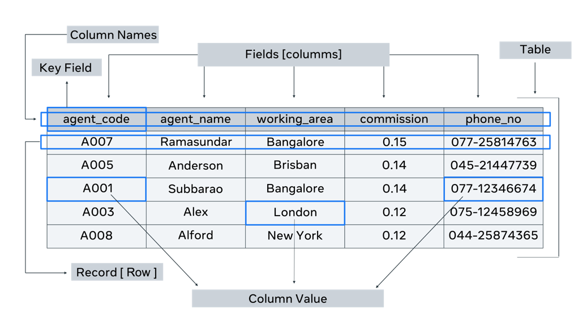

# Introduction to Databases

- A form of electronic storage in which data is organized systematically

## Database tasks
- Store data
- form relationships between segmented areas of the data
- filter the data to show relevant records
- search data to return matching records
- CRUD (create, update read delete) Operations

## DB Types
- relational DB (structured data in tabular form)
- Object oriented DB (data stored in form of objects/instances of a class)
- Graph DB (data stored in nodes, relationship b/w then are edges)
- Document db (Data stord as JSON objects)

## Big Data
- combination of strctured, semi-structured and unstructured data.
- more powerful than traditional data when solving problems
- better insights for decision making

#### Example: Manufacturing
- monitor equpment
- review prod
- forcast demand

# Introduction to SQL
- SQL - Structured Query Language
- interact with structured data on DB 

## SQL Syntax and Subsets:
- DDL (Data Definition Language)
    - create DB: 
    ```
    CREATE DATABASE db_name;
    ```
    - create table: 
    ```
    CREATE TABLE table_name;
    ```
- DML (Data Manipulation Language)
    - add data to table:
    ```
    INSERT INTO table_name (col_1, col_2, ...)
    VALUES (val_1, val_2, ...);
    ```
    - update data:
    ```
    UPDATE table_name 
    SET col_a = val_x 
    WHERE col_b_= val_y;
    ```
    - delete data;
    ```
    DELETE FROM table_name 
    WHERE col_name = some_val;
    ```
- DQL (Data Query Language)
    - query data within a table:
    ```
    SELECT col_x, col_y_, 
    FROM table_name 
    WHERE col_z = some_val;
    ```
- DCL (Data Control Language)

## BASIC TABLE STRUCTURE

- In relational database terminology a table is also known as a relation. A table row or a record is also known as a tuple.

- Each table or relation in a database has its own schema. Schema simply means the structure. The structure includes:

    - the name of the table or relation (`table_name`),
    - its attributes (`columns`),  
    - their names (`column_names`), 
    - and data type (`column_dtypes`).

### PRIMARY KEY
In a table, there is a field or column that is known as a key which can uniquely identify a particular tuple (row) in a relation (table). This key is specifically known as a `primary key`.

### FOREIGN KEY
Tables in a database do not stay isolated from each other. They need to have relationships between them. Tables are linked with one another through a key column (the primary key) of one table that’s also present in the related table as a `foreign key`.

### INTEGRITY CONSTRAINTS
Every table in a database should abide by rules or constraints. These are known as integrity constraints.
There are three main integrity constraints:

#### Key Constraints
There should be a column, or columns, in a table that can be used to fetch data for any row. This key attribute or primary key should never be NULL or the same for two different rows of data. 

#### Domain Constraints
Domain constraints refer to the rules defined for the values that can be stored for a certain column. For instance, you cannot store the home address of a student in the first name column. Similarly, a contact number cannot exceed ten digits.

#### Referential Integrity Constraints
When a table is related to another table via a foreign key column, then the referenced column value must exist in the other table.

## DB STRUCTURE


The structure of a database consists of a set of key components. These include:      

- Tables or entities, where the data is stored. 
- Attributes which are details about the table or entity. In other words, attributes describe the table.  
- Fields, which are columns used to capture attributes. 
- A record, which is one row of details about a table or entity. 
- primary key, which is a unique value for an entity.


## TYPE OF ATTRIBUTES/KEYS

### Simple
attributes that hold single value like `customer_name`

### Multivalued
can store multiple values in a single attribute/column. This should be avoided in relational db.

### Primary Key attribute
Used to uniquely identify an individual record(row).

### Candidate key attribute
unique value for each row, can be used as key

### Composite key
combination of 2 or more attrinutes to form a unique value for each record
