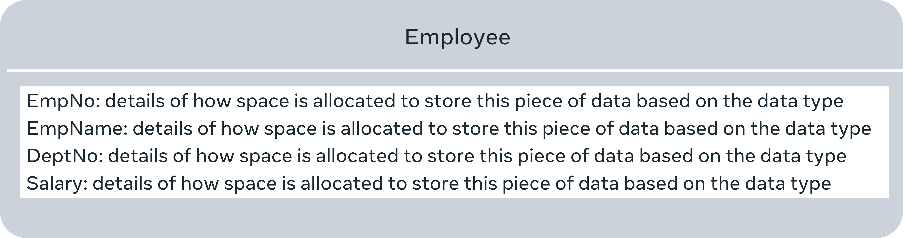
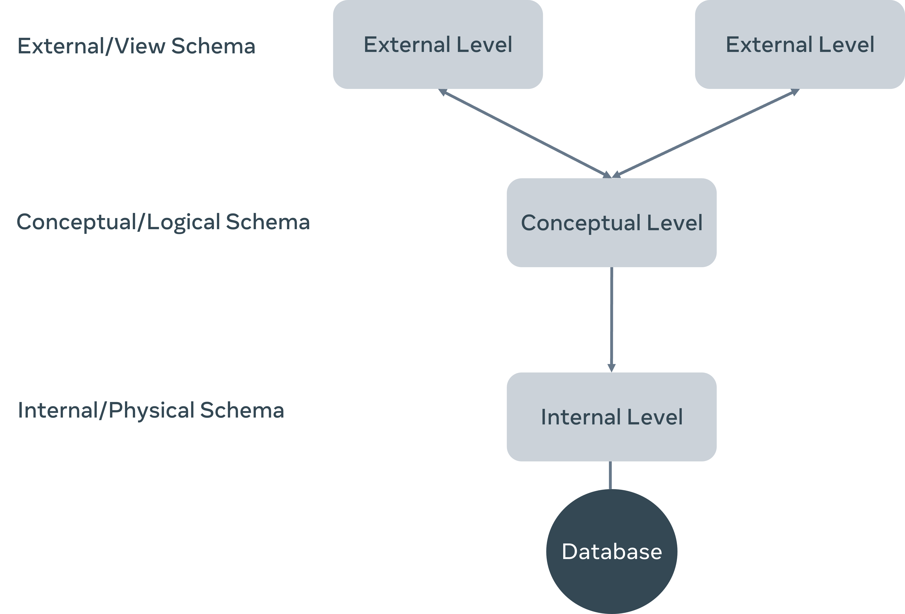

# DESIGNING DATABASE SCHEMA

The database schema is just the skeleton of the database, and it doesn’t store any actual data.

Database schema can be broadly divided into three categories. 

- Conceptual or logical schema that defines entities, attributes and relationships.

- Internal or physical schema that defines how data is stored in a secondary storage. In other words, the actual storage of data and access paths. 

- External or view schema that defines different user views.

These three levels of schema are also known as the three-schema architecture. It can be diagrammatically depicted like this.

# RELATIONAL DATABASE DESIGN

Fundamental concepts of the relational model

- `Relation`: A relation represents a file that stores data. It’s also known as a table.
- `Column`: Each column is a generic representation of the piece of data that needs to be stored.
- `Domain`: set of acceptable values that a column is allowed to contain
- `Record` or `tuple`: a row within a table
- `Key`: Each row or tuple has one or more attributes, known as a relation key, that can uniquely identify a specific row. This is also known as the primary key.
- `Degree`: number of columns or attributes within a relation
- `Cardinality`: number of records/rows there are within a particular table in a database
- `constraints`:
    - `Key constraints`: Primary key must be Unique and Not NULL
    - `Domain constraints`:  inserting values that have a valid data type. You cannot insert string into int column
    - `Referential integrity constraints`: The referential integrity constraint states that if a relation refers to a key attribute of another relation, then that key element must exist. In other words, there must be matching values in the two tables for that attribute.

# [DATABASE NORMALIZATION](https://www.coursera.org/learn/introduction-to-databases/supplement/v93wa/data-normalization)
The normalization process aims to minimize data duplications, avoid errors during data modifications, and simplify data queries from the database. The three fundamental normalization forms are known as:

## First Normal Form (1NF)
first normal form rules enforces the data atomicity rule and eliminate unnecessary repeating data groups. The data atomicity rule means you can only have one single instance value of the column attribute in any table cell.

## Second Normal Form (2NF)
In the second normal form, you must avoid partial dependency relationships between data. Partial dependency refers to tables with a composite primary key. Namely, a key that consists of a combination of two or more columns, where a non-key attribute value depends only on one part of the composite key.

## Third Normal Form (3NF)
For a relation in a database to be in the third normal form, it must already be in the second normal form (2NF). In addition, it must have no transitive dependency. This means that any non-key attribute in the surgery table may not be functionally dependent on another non-key attribute in the same table. 